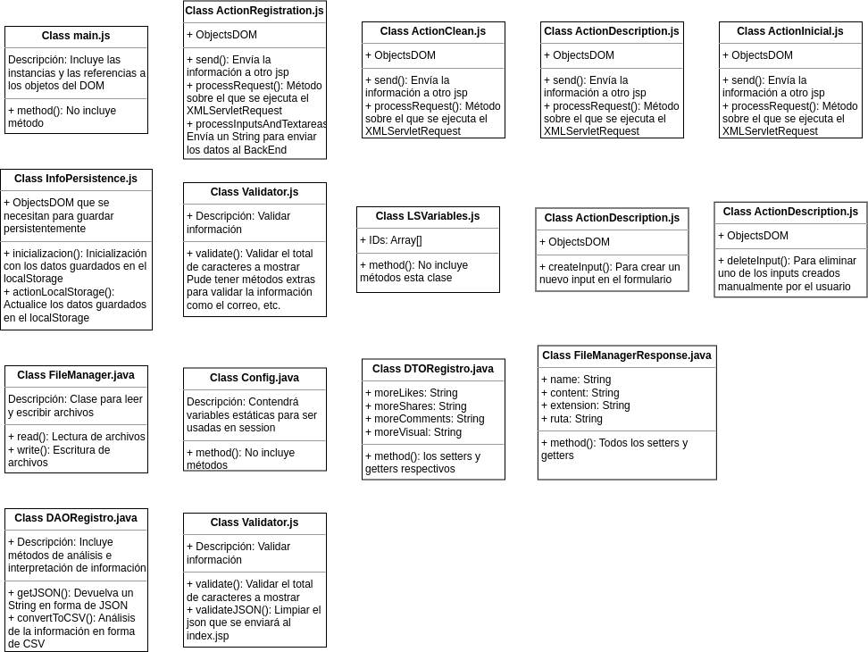

### Nombre: Franklin Ariel Gutierrez Castillo
### No. Cuenta: 20211021383
### Programacion Orientada a Objetos 1000

 

# Proyecto Final

## Análisis y diseño orientado a objetos 

* index.jsp: Será la página o vista principal

    * Está página contendrá las listas despegables (select), botones o hipervínculos, que llamarán distintas ventanas modales o páginas .jsp que funcionen como controladores. Entre las ventanas modales, debe existir una para la creación de un nuevo registro de mensajes, otra para ver información acerca del autor, incluso una para limpiar ese registro y la ventana modal puede servir como segunda consulta antes de eliminar el registro

    * El diseño será en base a clases de bootstrap

* style.css: Puede servir en caso de colocar algún estilo extra a algún objeto del DOM.

* main.js: Clase de JavaScript que tendrá instancias de las demás clases de JavaScript y las referencias a los objetos del DOM, por medio del document.querySelector

### Funcionalidades específicas .js

* Se solicita ingresar información del registroe y mostrar cierta información en la pantalla posterior a hacerse un registro, incluyendo nombre de usuario, la cuenta del usuario y los primeros 64 caracteres, entonces cuando se seleccione guardar se debe mostrar esta información, entonces, por un document.querySelector incluído en el main.js se puede invocar:
    
    * ActionRegistration.js que incluya métodos de comunicación asíncrona con el BackEnd para que guarde la información en un archivo .csv y al retorno muestre la información

* Se solicita limpiar el modelo de datos, en nuestro caso un archivo .csv al presionar cierto botón, es decir, crear un archivo vacío que incluya solo la fecha de creación, entonces, por un document.querySelector incluído en el main.js se puede invocar:

    * ActionClean.js que incluya métodos de comunicación asíncrona con el BackEnd para que limpie el modelo de datos y limpie también la pantalla principal al retorno

* Se solicita mostrar la descripción de un registro en específico cuando se de click en cierto botón, entonces, por medio de un document.querySelector incluido en la clase ActionRegistration se puede invocar:

    * ActionDescription.js que incluya métodos de comunicación asíncrona con el BackEnd para que devuelve la información específica de cierto registro

* También que al momento de refrescar la página o comenzar a correr la página se inicialize o muestre los registros guardados en el modelo de datos, si es que existe y tiene, sino debe ser creado el modelo, entonces, por comunicación asíncrona y con instancia en el main.js se puede invocar:

    * ActionInicial.js que lea el modelo de datos o lo cree y muestre los datos necesarios en la vista

* Se solicita que al momento de crear un nuevo registro, si no se guarda la información y se le da actualizar a la página, esta debe de recordar lo que el usuario había escrito en el último intento de registro, entonces, en el main.js se puede invocar:

    * InfoPersistance.js que guarde por medio del window.localStorage la información que se estaba escribiendo por parte del usuario

* Se solicita que al momento de crear la información del registro esta debe tener un mínimo y un máximo de caracteres, entonces, cuando se de guardar debe invocarse

    * Validator.js para hacer una validación de la información antes de ser enviada al BackEnd

* Se solicita que la página invoque varias ventanas modales, entonces con una instancia en el main.js, se puede invoca:

    * ModalEncabezado.js que incluya métodos para mostrar las diferentes ventanas modales

* Se solicita que el usuario, al momento de crear una solicitud de una registro de un twitt pueda incluir cero, una o más URLs de imágenes, entonces se pueden invocar las siguientes clases:

    * CreateElement.js para poder crear un nuevo input para incluir una nueva URL

    * DeleteElement.js para poder eliminar los input extras que ha creado con la clase anterior

* Como clase de javaScript extra, una que contenga un array que pueda contener los id de los inputs para poder hacer análisis de los mismos, entonces se puede crear:

    * LSVariables que contenga en su constructor un array para poder guardar los id de los inputs

### Funcionalidades específicas .java

* Se solicita guardar la información en un modelo de datos, como requerimiento del ejercicio un archivo.csv, por lo tanto debe existir

    * FileManager.java, FileManagerResponse y sus respectivas Interfaces, para la lectura y escritura de archivos, su funcionalidad ha sido más específicada en otras actividades

* Se solicita que la aplicación lleve registro del twit con más likes, shares, comentarios, entre otros, así que se puede implementar:

    * Config.java que incluya nombre de las sesiones que serán guardas en session, así lleve el recuento y el análisis de los registros

    * DTORegistro.java que incluya los datos que serán guardados en la sesión

    * DAORegistro.java que incluya métodos que análicen la información y se pueda retornar un JSON que puede ser analizado en el FrontEnd, también para el transporte de datos un análisis de un csv como un método convertToCSV

    * Validator.java que valide la información recibida, que valide y limpie el json para que no presente problemas.

### Funcionalidades específicas .jsp

    * serviceClean.jsp esta es la página service que será llamada por el ActionClean por comunicación asíncrona cuando se desee limpiar el modelo de datos

    * serviceCreate.jsp es la página service que será llamada por el ActionCreate por comunicación asíncrona cuando se desee incluir un nuevo registro al modelo de datos

    * serviceDescription.jsp es la página que será llamada por el ActionDescription por comunicación asíncrona cuando se desee extraer la información de un registro en específico

    * serviceInicial.jso es la página que será llamada por el ActionInicial por comunicación asíncrona cuando se actualice la página o se corra el servidor

### Funcionalidades EXTRAS

* Uso de eventos por medio del addEventListener, como ser:

    * click cuando se presiones sobre un botón y este debe hacer alguna acción

    * change que nos puede servir el la persistencia y al momento de ir contado los caracteres

### Diagramas UML

